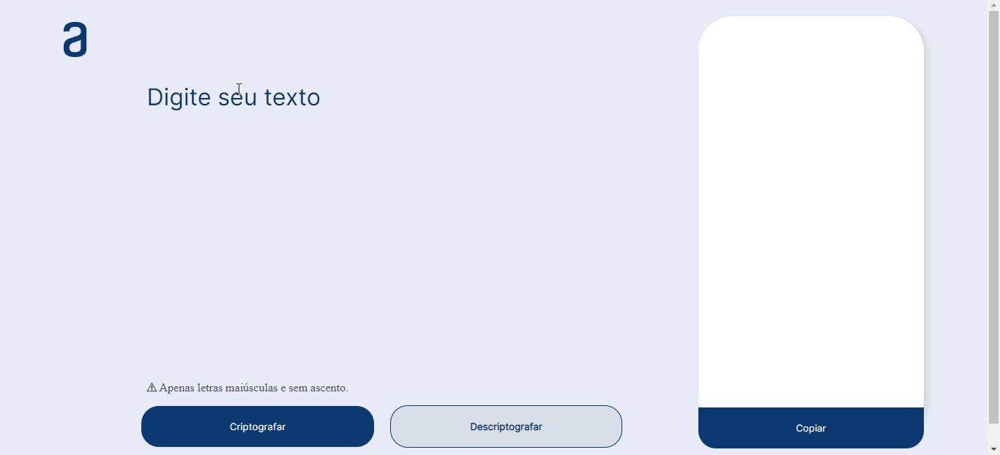

<h1 align="center" id="título"> Decodificador de Textos </h1>

 

# Índice

* [Título](#título)
* [Badges](#badges)
* [Índice](#índice)
* [Descrição do Projeto](#descrição-do-projeto)
* [Funcionalidades e Demonstração da Aplicação](#funcionalidades-e-demonstração-da-aplicação)
* [Acesso ao Projeto](#acesso-ao-projeto)
* [Tecnologias utilizadas](#tecnologias-utilizadas)

<h2 id="descrição-do-projeto">O Encriptador</h2>

Uma página web para criptografar e descriptografar textos inseridos pelo usuário. No momento ainda não suporta caracteres especias (com ascento).

<h2 id="funcionalidades-e-demonstração-da-aplicação">:hammer: Funcionalidas do projeto</h2>
<ul>
  <li>Criptografar: Pega a string passada pelo usuário e a transforma em um texto criptografado</li>
  <li>Descriptografar: Pega a string criptografada passada pelo usuário, e a transforma em um texto descriptografado</li>
</ul>

<h2 id="acesso-ao-projeto">📁 Acesso ao projeto</h2>

Você pode acessar o <a href=https://github.com/danielribeiroDev/Decodificador/find/main text-decoration="underline">código fonte do projeto</a> ou <a href="https://github.com/danielribeiroDev/Decodificador">baixá-lo</a>.

<h2>🛠️ Abrir e rodar o projeto</h2>
<ul>
  <li>Após baixar o projeto, você pode abrir com o editor de código de sua preferência.</li>
  <li>Para rodar o encriptador, é só clicar em cima do arquivo index.html que ele será aberto no navegador.
</ul>

<h2 id="tecnologias-utilizadas">✔️ Tecnologias utilizadas</h2>

`Javascript` `HTML5` `CSS3` 

<h2>Autor</h2>

|  Daniel Dias Ribeiro |
| :---: |
